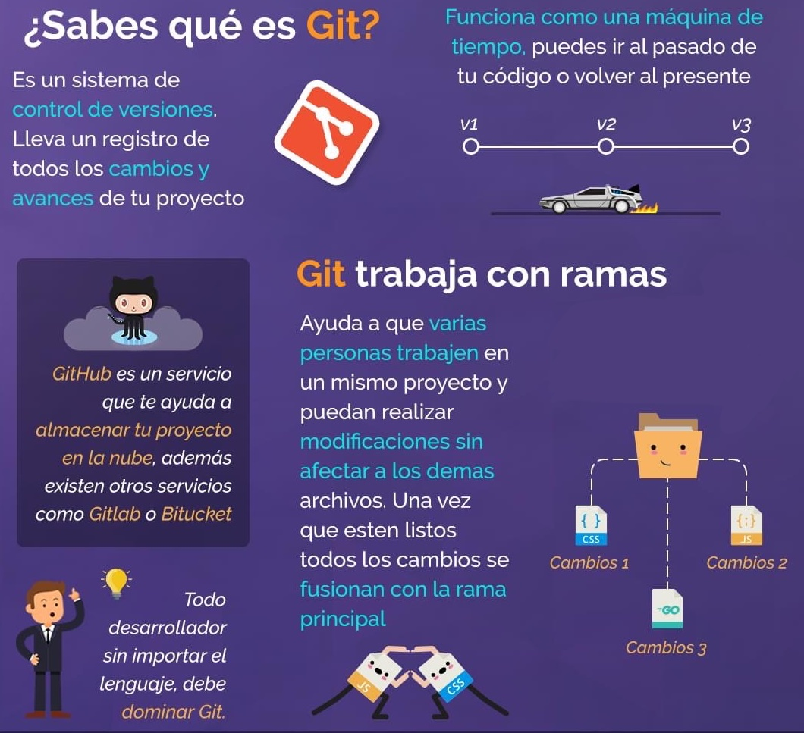
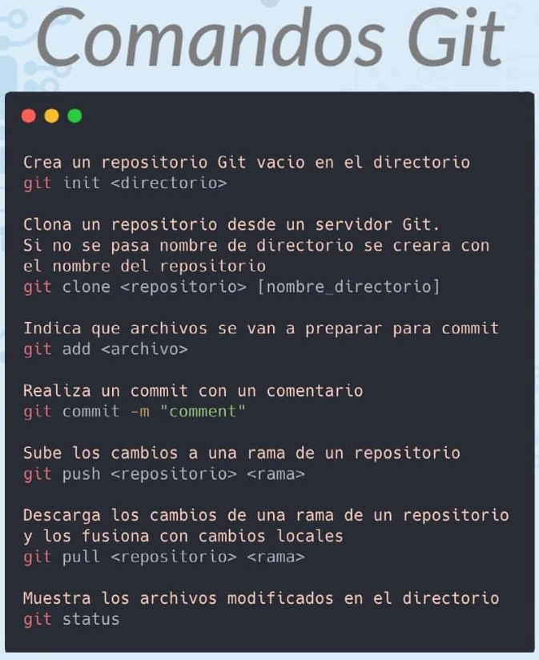
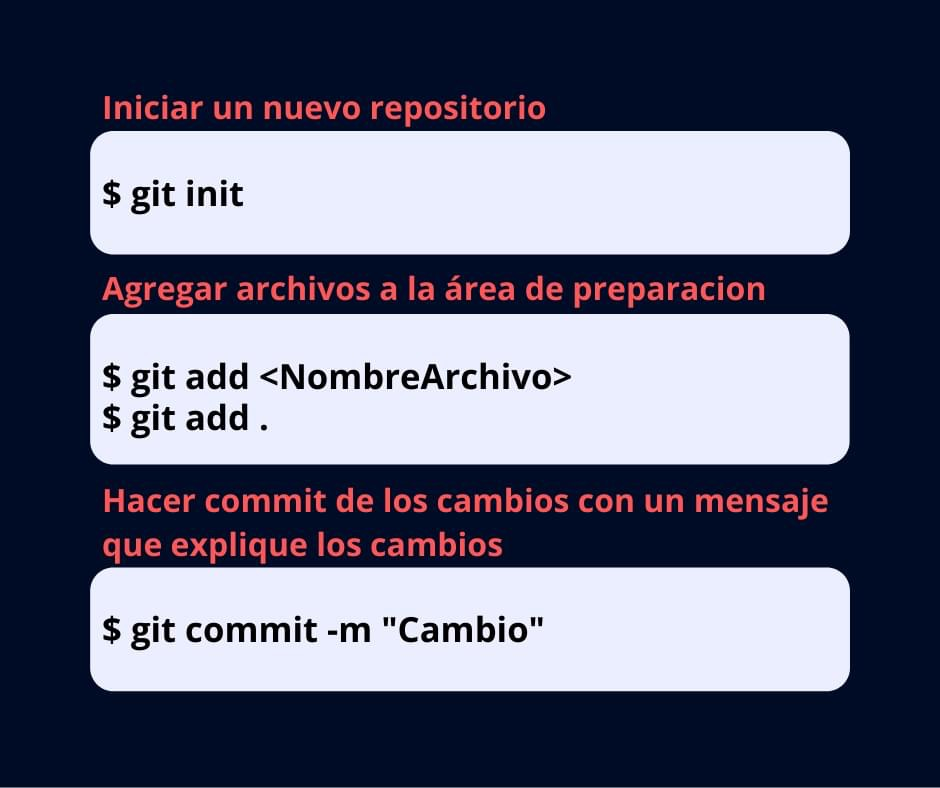
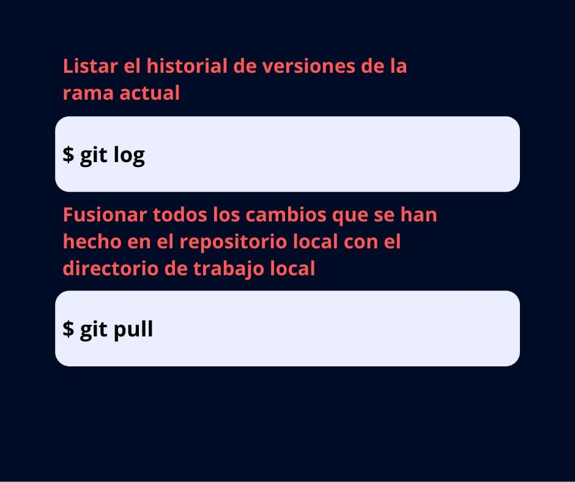
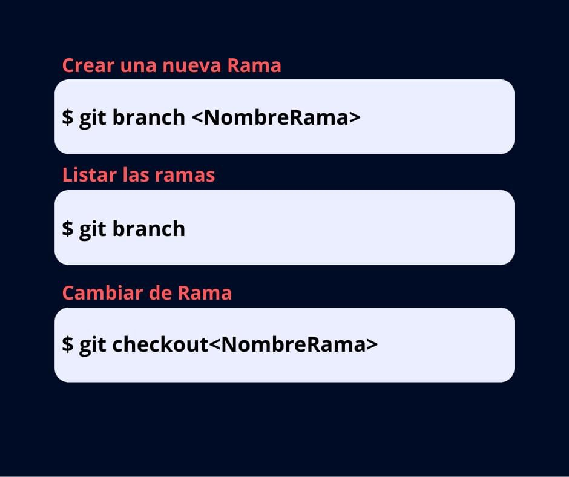
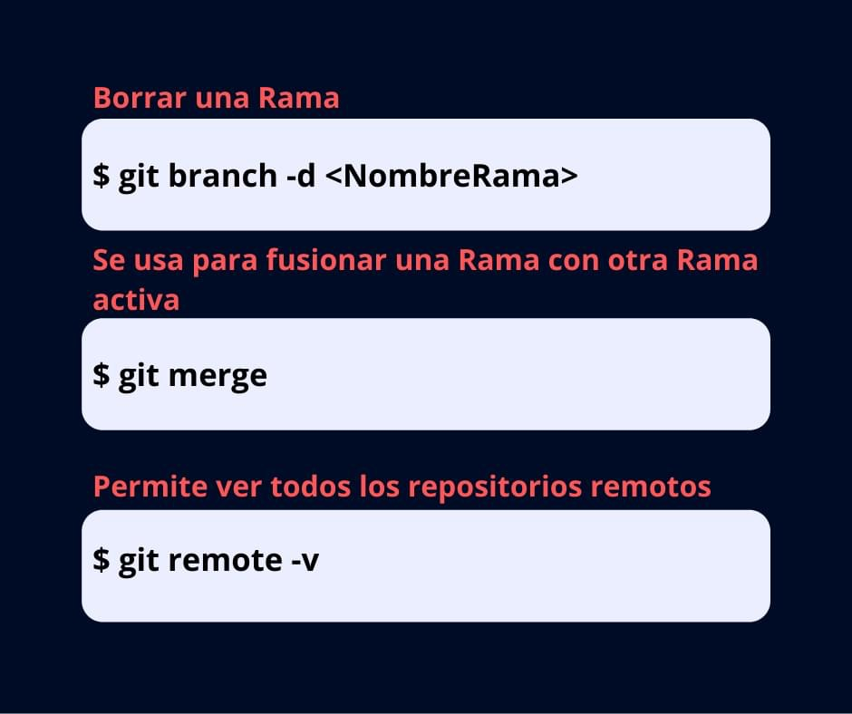

# GIT

## El problema

* Los programas que escribimos se componen de uno o más archivos de texto.
* A esta composición la llamamos proyecto.
* Estos archivos pueden ser el código propiamente dicho o archivos de configuración de la solución.
* Tenerlo en una carpeta en nuestra computadora parece una buena idea.
* Pero ¿que pasa si necesitamos volver a una versión anterior? ¿compartirlo con nuestros compañeros? ¿controlar los cambios?
* Necesitamos:
  * un lugar compartido por el equipo donde guardarlo
  * con control de cambios: en el proceso de desarrollo de software es un requisito casi indispensable mantener un registro de los cambios que se realizan sobre el código fuente a lo largo del tiempo.
  * que permita trabajar de forma colaborativa

## La solución: Git y GitHub o GitLab

* **Git** es un sistema de control de versiones distribuido desarrollado originalmente por Linus Torvalds.
  * Permite seguimiento de cambios en el código y quien los hizo
  * Permite la colaboración
  * Es software libre
  * Funciona bajo cualquier plataforma (Windows, MacOS, Linux, etc.)
  * Está integrado en una amplia variedad de entornos de desarrollo (IDEs)

  
  [Sitio Oficial Git](https://git-scm.com)

* **GitHub/GitLab** son plataformas web para gestionar proyectos con Git en equipo
  * Grupos / Proyectos
  * Permite el seguimiento de Issues
  * Permite colaborar entre distintos equipos

  
  [Sitio Oficial GitHub](https://github.com)
  [Sitio Oficial GitLab](https://about.gitlab.com)

## Git

* Lo instalamos desde el portal
* Comando git de consola cmd o bash
* Podemos empezar a trabajar de dos formas:
  * Creando un repo desde cero
  * Clonando un repo


## Git - contribuyendo en un proyecto


## ¿Cómo trabajar en equipo con Git?


## Git - creando un repo local

```cmd
$mkdir workspace
$cd workspace
$git init 
Inicializando repositorio Git vacío en /home/u45812/worspace/.git/
$echo Hola, mundo! > saludo.txt
$echo Hasta luego! > despedida.txt
$git status
En la rama master

No hay commits todavía

Archivos sin seguimiento:
  (usa "git add <archivo>..." para incluirlo a lo que se será confirmado)
    despedida.txt
    saludo.txt
no hay nada agregado al commit pero hay archivos sin seguimiento presentes (usa "git add" para hacerles seguimiento) 
```

## Git - jugando con el repo

```cmd
$git add saludo.txt despedida.txt
$git status
En la rama master

No hay commits todavía

Cambios a ser confirmados:
  (usa "git rm --cached <archivo>..." para sacar del área de stage)
    nuevos archivos: despedida.txt
    nuevos archivos: saludo.txt

$git commit -m "registro saludo y despedida"
[master (commit-raíz) 742fada] registro saludo y despedida
 2 files changed, 2 insertions(+)
 create mode 100644 despedida.txt
 create mode 100644 saludo.txt

$git status
En la rama master
nada para hacer commit, el árbol de trabajo está limpio
```

## Git - cambiando el repo

```cmd
$echo "Como estas?" >> saludo.txt
$git status
En la rama master

Cambios no rastreados para el commit:
  (usa "git add <archivo>..." para actualizar lo que será confirmado)
  (usa "git restore <archivo>..." para descartar los cambios en el directorio
de trabajo)
    modificados: saludo.txt

sin cambios agregados al commit (usa "git add" y/o "git commit -a")

$git add saludo.txt
$git commit -m "mejoramos el saludo"
[master 7d08b29] mejoramos el saludo
 1 file changed, 1 insertion(+)

$ git status
En la rama master
nada para hacer commit, el árbol de trabajo está limpio
```

## Git - viendo la historia

```cmd
$git log
commit 7d08b295bd3fa53860684636b01a2b56fa719365 (HEAD -> master)
Author: Pablo <ppandolfo@afip.gob.ar>
Date: Fri Mar 10 09:01:44 2023 -0300
    
    mejoramos el saludo

commit 742fada9c90b1d50f940ffa1087d300784d091b0
Author: Pablo <mcarboni@afip.gob.ar>
Date: Wed Mar 8 23:50:34 2023 -0300
    
    registro saludo y despedida
(END)
# SALIMOS CON LA LETRA q
```

## Git - clonando un repo

* Vamos a conectar nuestro repo local con el remoto. Ejemplo:


```cmd
$git clone git@gitlab.cloudint.afip.gob.ar:ppandolfo/taller-repos.git
```

* Cuando queremos empezar a trabajar en un repo ya existente
* Trae la última versión del repo en su rama principal (master)
* Es un clon. Es decir, otro repositorio igualito
* Trabajamos con las mismas ideas, add, commit y push...
* Aparecen fetch y pull

## Git - flujo de trabajo básico


* El **directorio de trabajo** son los archivos que vemos
* El **stage o index** es lo que va al próximo commit
* La **Historia** es una red de commits. A algunos tramos los nombramos como branches o ramas.

## Git - commit, branch y HEAD


* **commit**: cada vez que queremos guardar un estado del
index. (verdes)
* **branch**: etiqueta asociada a un branch (naranja)
* **HEAD**: referencia especial a donde va el próximo commit

## Git - checkout branch

```cmd
$git checkout feature
```


* Mueve el HEAD de la rama master a la rama feature.
* El index y el directorio de trabajo pasan a tener el código del
commit caf3.

## Git - ckeckout HEAD~1

```cmd
$git checkout HEAD~1
```


* Mueve el HEAD un commit atrás.
* El index y el directorio de trabajo pasan a tener el código del
commit 34bc.

## Git - commit

```cmd
$git commit -m "agregamos"
```


* Crea el commit e4d2 con el código como está en Stage
* Mueve las referencias de HEAD

## Git - checkout -b

```cmd
$git checkout -b nuevo
```


* Crea el branch nuevo y lo asocia al HEAD.
* Asocia la referencia de HEAD a este branch.
* Todos los siguientes commits estarán asociados al branch

## Git  - comandos básicos

| Comando | Uso |
| -- | -- |
| **git init** | crea un proyecto nuevo en git |
| **git clone** | hace una copia del servidor central a tu computadora |
| **git add \<file>** | pasa los archivos del working directory al stagging area |
| **git commit** | pasa del stagging area al local repo |
| **git push** | subir a un repositorio remoto |
| **git pull** | trae los cambios de los desarrolladores |
| **git status** | ver en que estado están los archivos |









## Guia de inicio rápido

1. Tener una cuenta de GitHub y acceso a Internet
1. New repository y se completa name, public o private, si se agrega archivo README, si se agrega archivo .gitignore. Luego clic en botón "Create repository"
1. Create branch (para mantener las correcciones de errores y el trabajo de cracteristicas separados de nuestra rama de producción). Cuando un cambio está listo se fusionan las ramas.


